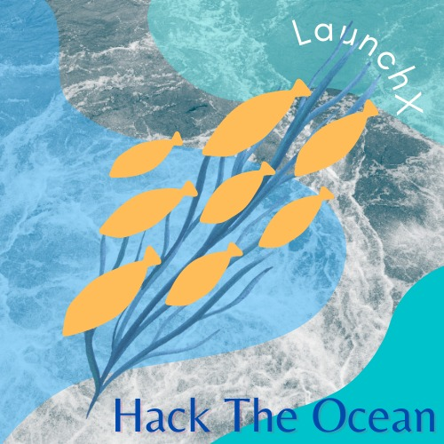
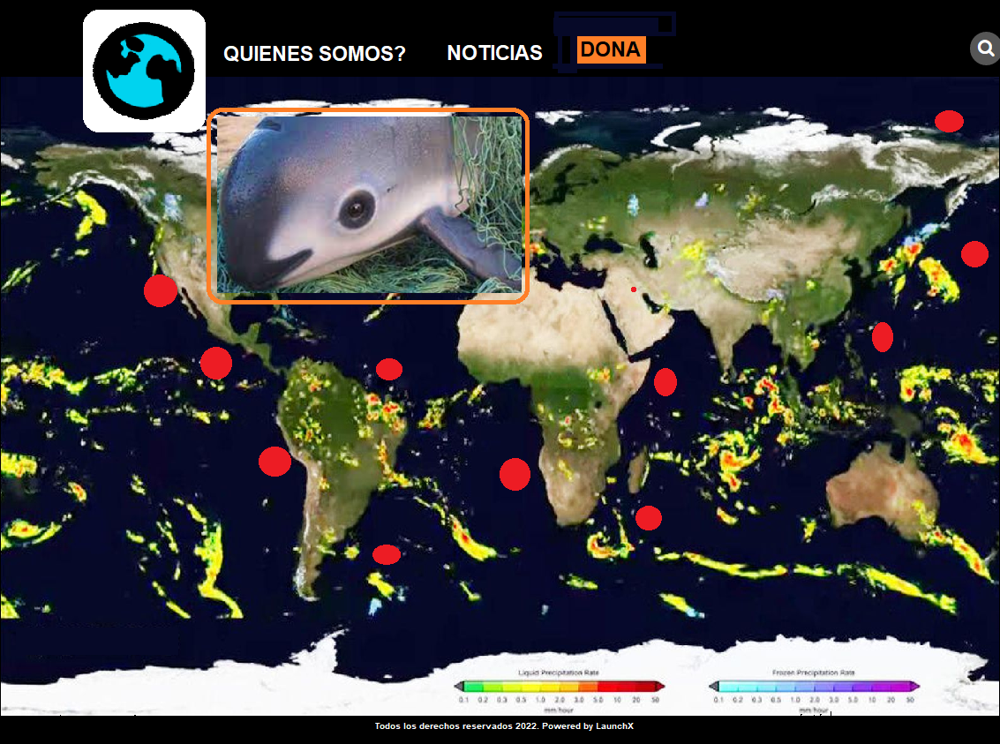
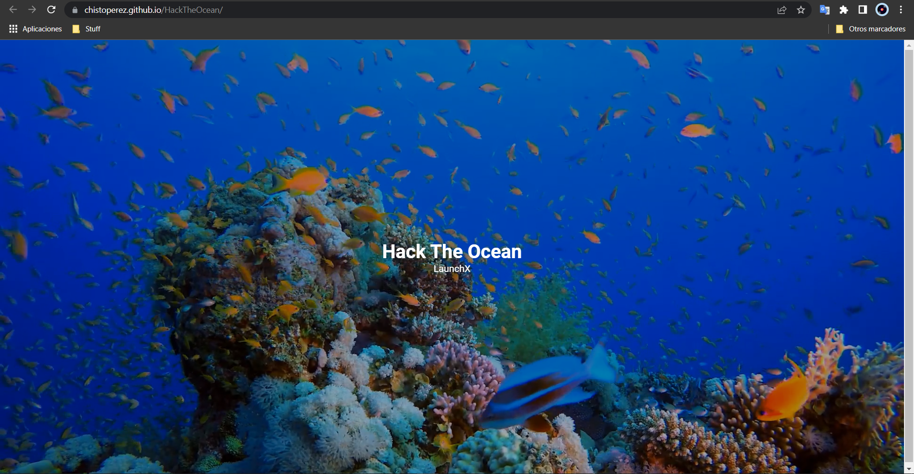

# Save the Ocean 🐋

_"¿Qué es el mar? Según las teorías de evolución más aceptadas de ahí viene el hombre, pero desde que existe registro hemos vivido siempre en la tierra y desde que el hombre la pisó por primera vez, dejamos de verla para mirar hacia arriba y conquistar el cielo._

_Por años hicimos todo para dominar el aire y cuando lo logramos, comenzamos a navegar entre las nubes para voltear por fin hacia abajo. Hacia la majestuosidad del gran azul que domina el paisaje de nuestro mundo, el mar se ha convertido en algo con lo que soñamos constantemente y que admiramos en su grandeza._

_Un majestuoso imán azul que nos llama de regreso a nuestro génesis, solo tenemos que dar un paso más allá y sentir la sal en el aire. Lo único que tenemos que hacer es quedarnos quietos para que el mar tranquilamente se acerque a nosotros con su vaivén seductor._

_El mar abierto nos está llamando para despertar y vivir ese sueño, solo tenemos que abrir los ojos."_

Jerónimo Prieto. (2014). México pelágico. Pelagic Life, Calypso Films

 

## Proyecto para el Hackaton: Hack the Ocean

 

  EL RETO 

Elaborar un proyecto web (fullstack) que de solución escalable y ágil a una problemática relacionada con los océanos, utilizando, las tecnologías, marcos de trabajo y metodologías revisadas en Launch X.

Los ejes del hackathon que pueden seleccionar para desarrollar una solución son:

* **Especies en peligro de extensión.**
* ~~Contaminación (acidificación, derrames petroleros, etcétera).~~
* ~~Cuidado y preservación de especies marinas.~~
* ~~Sobrepesca~~

  NUESTRA SOLUCIÓN 

_"Salvar nuestro océanos poniendo un granito de arena con nuestros conocimientos en la tecnología."_
 

Se elabora un proyecto con conciencia, con una visión de nuestro mundo, de nuestros océanos, que nos permite voltear a ver un problema y darle la atención necesaria.
 

Este proyecto revisa las especies en peligro de extinción a nivel mundial, mediante una API especializada que conforma la _Red List IUCN (International Union for Conservation of Nature)_ Unión Internacional para la Conservación de la Naturaleza.
 

Nuestra solución a este problema es que una vez identificada la amenaza canalizar y fortalecer mediante las organizaciones:

- Protección y Conservación Pelágica AC [Pelagic Life](http://www.pelagiclife.org/)
- Fondo Mundial para la naturaleza [WFF](https://www.wwf.org.mx/)
- La Asociación Mexicana de Hábitats para la Interacción y Protección de Mamíferos Marinos [AMHMAR](http://www.amhmar.org.mx/)
- Oceana [Oceana](https://mx.oceana.org/)

 

| Contenido | Link |
|:---:|:---|
|Front-End |   |
|Back-End|  |
|API |  |

### Documentación

  Diagrama de la solución 

 

  Diseño 

 

  Innovación 

* Uso de mapas globales
* Consulta de coordenadas geográficas
* Consulta de API especializada en animales en peligro de extinción

  Complejidad Técnica 

* Front-End: 
* Back-End: 
* Base de Datos: 

  Escalabilidad 

* Proyecto modularizado en React
* Controlador de servicios REST con NodeJS
* Almacenamiento de información en base de datos NoSQL Mongo DB

## Team

*  Lucy [@lukitachan](https://github.com/lukitachan)
*  Christopher [@chistoperez](https://github.com/chistoperez)
*  Alfred [@dfredude](https://github.com/dfredude)
*  Rafael [@doguedogue](https://github.com/doguedogue)

Todos los derechos reservados 2022 &copy;
